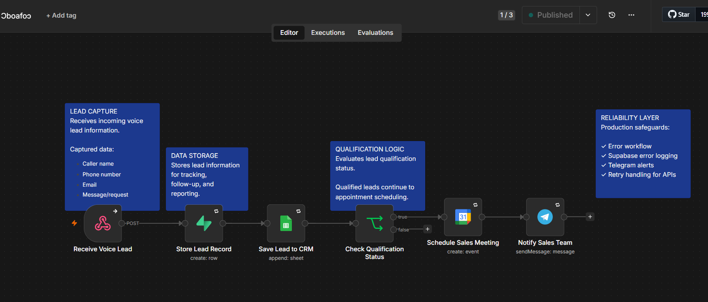
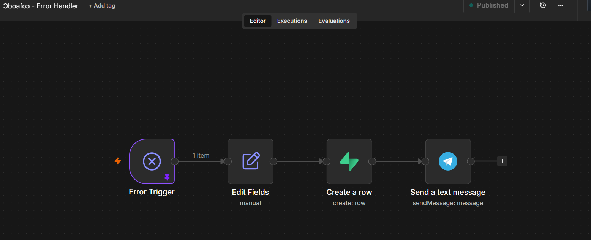

# Ɔboafoɔ — AI Voice Sales Assistant

## Overview 

Ɔboafoɔ is an AI-powered voice sales assistant designed to help businesses automate lead capture, qualification, and follow-up processes.

The system uses **ElevenLabs Conversational AI** as the customer-facing voice agent and **n8n** as the workflow automation layer.

ElevenLabs handles customer conversations and collects relevant information, while n8n processes the data, updates business systems, applies qualification logic, schedules actions, and sends notifications.

The goal is to help businesses respond to leads faster, reduce repetitive manual tasks, and improve sales operations.

---

## Problem

Many businesses lose potential customers because of inefficient lead management processes.

Common challenges include:

* Slow responses to customer inquiries.
* Manual collection and organization of lead information.
* Lack of consistent lead qualification.
* Poor visibility into workflow failures.
* Time wasted on repetitive administrative tasks.

---

## Solution

Ɔboafoɔ automates the lead management process using conversational AI and workflow automation.

The system:

1. Engages customers through an AI voice agent.
2. Collects customer information during conversations.
3. Sends structured data to an n8n workflow.
4. Stores lead information.
5. Updates the CRM system.
6. Evaluates lead qualification status.
7. Creates calendar appointments for qualified leads.
8. Sends notifications to the team.

---

# Architecture

Ɔboafoɔ separates customer interaction from backend business automation.

```text
Customer
   |
   ↓
ElevenLabs Conversational AI Agent
   |
   ↓
n8n Workflow Automation
   |
   ├── Supabase
   |    Lead storage & error logging
   |
   ├── Google Sheets
   |    CRM management
   |
   ├── IF Node
   |    Lead qualification logic
   |
   ├── Google Calendar
   |    Appointment scheduling
   |
   └── Telegram
        Team notifications
```

---

# Workflow Breakdown

## 1. AI Voice Interaction

The ElevenLabs Conversational AI agent interacts with customers through natural voice conversations.

During the conversation, the agent collects relevant customer details and sends structured information to the automation workflow.

Collected information may include:

* Customer name
* Phone number
* Email address
* Customer request

---

## 2. Lead Processing

The n8n workflow receives the customer information and processes the data through connected business applications.

The workflow acts as the automation layer responsible for moving information between systems.

---

## 3. CRM Management

Lead information is saved into Google Sheets, which serves as a lightweight CRM system.

This allows teams to:

* Track incoming leads.
* Review customer information.
* Manage follow-up activities.

---

## 4. Lead Qualification

Qualification logic is handled inside n8n using conditional workflows.

The IF node evaluates the qualification status and determines the next step.

Qualified leads continue through the appointment workflow.

---

## 5. Appointment Scheduling

Qualified leads can trigger calendar actions through Google Calendar.

This reduces manual scheduling and improves response time.

---

## 6. Team Notifications

Telegram notifications keep the team updated when important workflow events occur.

---

# Reliability & Error Handling

To make the workflow more production-ready, Ɔboafoɔ includes reliability features for monitoring and failure recovery.

## Error Workflow

A dedicated n8n Error Workflow captures failures from the main automation workflow.

When an error occurs:

1. The failure is detected.
2. Error details are extracted.
3. Logs are stored.
4. The team receives an alert.

---

## Error Logging

Workflow failures are recorded in Supabase.

Captured information includes:

* Workflow name
* Failed node
* Error message
* Execution ID
* Timestamp

This makes debugging and monitoring easier.

---

## Retry Handling

External service failures are handled using retry mechanisms.

Retry logic is applied to external integrations to recover from temporary issues such as:

* API interruptions.
* Network failures.
* Temporary service downtime.

---

# Key Implementation Decisions

## Separation of Responsibilities

The system separates the voice interaction layer from backend automation.

* ElevenLabs manages customer conversations.
* n8n manages business processes and integrations.

This makes the system easier to maintain and expand.

---

## Production-Oriented Error Management

Instead of allowing failures to silently stop the workflow, Ɔboafoɔ captures errors, stores logs, and sends alerts.

---

## Workflow Resilience

Retry mechanisms were implemented for external services to improve reliability and reduce failures caused by temporary problems.

---

# Tech Stack

| Technology                   | Purpose                               |
| ---------------------------- | ------------------------------------- |
| ElevenLabs Conversational AI | Voice AI sales agent                  |
| n8n                          | Workflow automation and orchestration |
| Supabase                     | Data storage and error logging        |
| Google Sheets                | CRM management                        |
| Google Calendar              | Scheduling                            |
| Telegram Bot API             | Notifications                         |

---

# Screenshots

## Workflow Architecture



## Error Handling



---

# Future Improvements

Potential improvements include:

* Automated lead follow-up campaigns.
* SMS/email reminders for appointments.
* Integration with dedicated CRM platforms.
* Automated lead scoring.
* Sales analytics dashboards.
* AI-powered follow-up campaigns.
* Multi-channel customer engagement.

---

# Project Status

Completed prototype with production-readiness improvements including:

✅ AI voice lead capture
✅ Automated workflow orchestration
✅ CRM updates
✅ Qualification logic
✅ Appointment scheduling
✅ Error workflow
✅ Supabase error logging
✅ Telegram notifications
✅ Retry handling

---

## Author

Built by Patricia Fleku as an AI automation implementation project.
